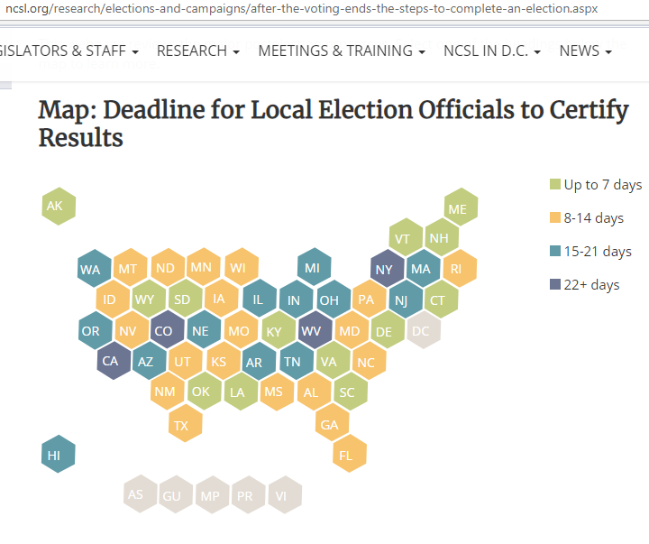
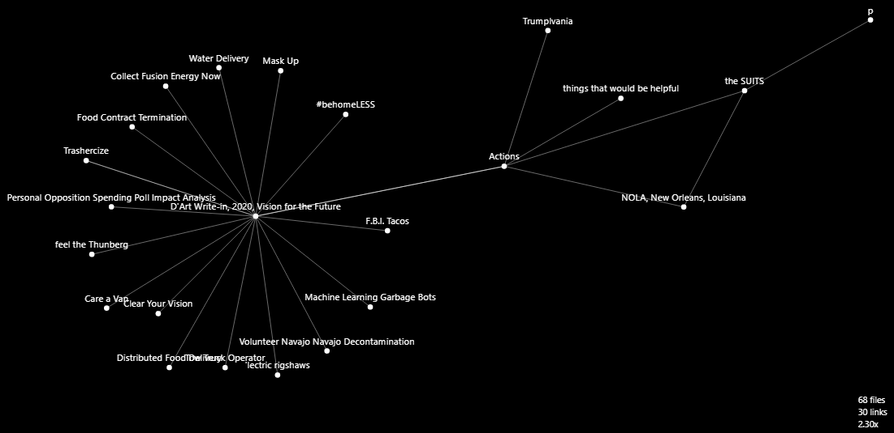
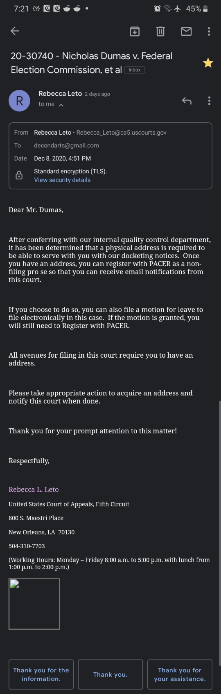
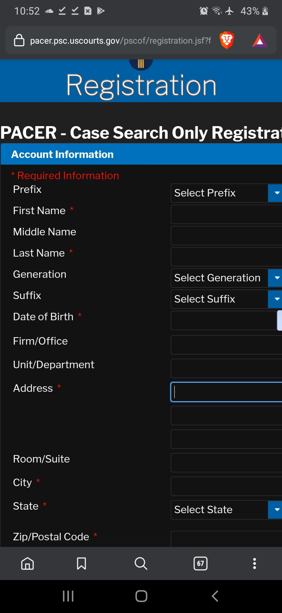
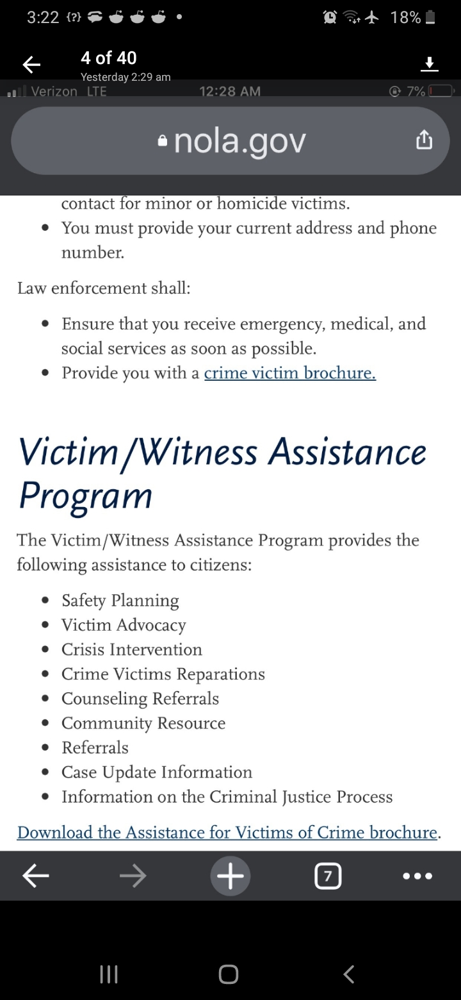
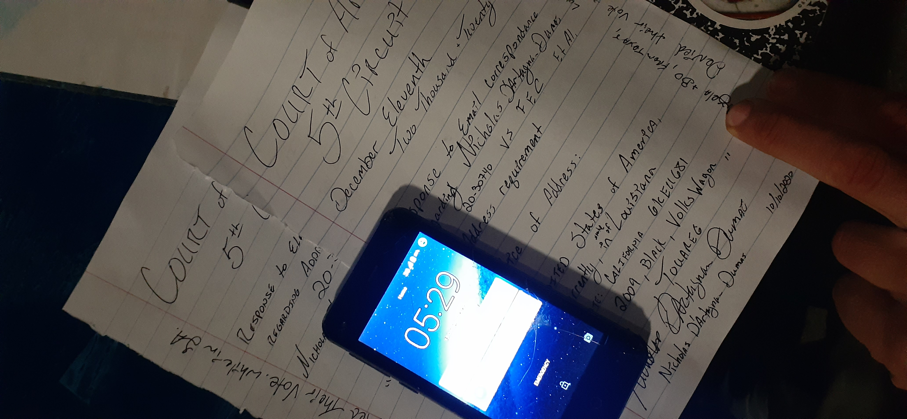

# Actions<!--MetaTagging - https://gist.github.com/lancejpollard/1978404 & HEAD https://github.com/joshbuchea/HEAD--><meta charset="utf-8"><meta name="viewport" content="width=device-width, initial-scale=1"><meta name="robots" content="index,follow"><meta http-equiv="x-dns-prefetch-control" content="on"><meta name="keywords" content="United States, President, Election, FEC, Biden, Trump, Candidate, Election Results, Election Information, SCOTUS, Congress, Representatives"/><meta name="description" content="Nicholas D'Artagnan Dumas Runs a Presidential Fitness Test"><meta name="subject" content="Nicholas D'Artagnan Dumas 2020 Election President United States Anti Campaign"><meta name="topic" content="2020 Presidential Election, Electoral College, SCOTUS"><meta name="category" content="Politics, Residence"><meta name="og:country-name" content="USA"/><!--<meta name="monetization" content="$paymentpointer.example">-->

___

do the things

[meet with me](https://calendly.com/decondarts)

## [D'Artagnan's Dartanium](https://OpenCollective.com/Dartanium "Brief Outline earlier this year")

---

Under continual construction; please click view on GitHub for more.Feel free to contribute an issue.
Mouse hovers over links have info; if U've no 'meece' then read the raw (top right next to blame - after going to "View on Github").

## [Actions](actions/README.md#actions-initialized "Top Level")

___

This all started with a handshake in 2011.

## What is Presidential Fitness

### [Presidential Run](actions/README.md#what-have-i-been-up-to "What is Presidential Fitness?")

  - Style/motif:

    - No Campaign Fundraising or Paid Advertising

    - request
      - private social sharing (friends & friends of friends)

    - "Where's Waldo" style travels
      - eg: no prior setup, no telling where I'm going next, 'pass-back' what I've done once I've left via SMS.
      - I've been through:
        - (*California, Oregon, Washington = Mask ⬆️ & F.B.I. Tacos*)  Idaho, Utah, Arizona. Nevada, *[Navajo Nation](https://github.com/ActionProjects/Actions/blob/main/actions/README.md#--volunteer-navajo-nation-decontamination-captured-this-moment) (discussed COVID decon with H.C.O.C. & President Nez, re: [C.A.R.E.S. Act](https://github.com/ActionProjects/Actions/blob/main/actions/pages/2020/vnnd.md#vnnd "$10mil Decon")*, New Mexico, Texas, Louisiana (current); with verbal and written vote pledges

    - [a wikiDraft](https://en.wikipedia.org/wiki/Draft:Nicholas_D%27Artagnan_Dumas)
      - [Qualified Write-Ins](https://web.archive.org/web/20201117175227/https://www.countyofnapa.org/DocumentCenter/View/16379/March-3-2020--Qualified-Write-In-Candidates---President) -note Libertarian & CA SoS/ ElDo Elections Complaint
     - "My" Electoral College *Candidates*
       - [see the pledges here](actions/_assets/electors) [Ooof, or here](https://github.com/ActionProjects/Actions/tree/main/actions/pages/theSuits/Complaints/_assets/electoralSigs)
<!--#todo+todo deduplication & checkboxes-->

  - ##### The Race is *Still* ON [Trump Campaign site pdf search](actions/pages/theSuits/Complaints/Presidential_Campaign/Support.md#stay-up-to-date)

[Dec. 8 & Dec. 14, 2020: Deadline for Resolving Election Disputes - 3 U.S.C. § 5](https://www.ncsl.org/research/elections-and-campaigns/the-electoral-college.aspx) ref: [Support.md](actions/pages/theSuits/Complaints/Presidential_Campaign/Support.md) sourcing all suit info.

<!---->

  - #### A map
  of pages linked as of November 16th, 2020 30 of 68 Linked; so, browse around <a href="http://ghv.artzub.com/#repo=Actions&climit=500&user=actionprojects">[this Viz Says More Files & PDFs]</a>

- ### Law is Code; right

[Now in Appeals after rushed misinterpretation from Judge](https://dockets.justia.com/docket/louisiana/laedce/2:2020cv02966/247760)

  - #### [Legal Actions](actions/pages/theSuits/README.md#the-suits "our country has problems")

This is a primary component to the case: "Address" vs "Residency"

'Already filed/filing Pro Se'

Witnessed an officer being shot in the face.

Address Filed

- ### Hijacked System - the "Electoral College" & are "Parties Special Interest" (coming)

  - when I hung out in a 'smart college town' the Electoral College was something to get rid of...

- on, social, bias & reward systems <a href="https://upload.wikimedia.org/wikipedia/commons/6/65/Cognitive_bias_codex_en.svg">really, it's g'in'to be alright</a>

- ***How to do it right.*** <a href="https://www.psychologytoday.com/us/blog/reading-minds/201702/three-myths-about-reading-levels">would you trust a bunch of 5th Graders?</a>
<!-- probabilities / ... "that other thought when ..." -->

## loggin'

___

- [large, Pic, semi-journal](actions/pages/postBlogPicsMyb.md#washington "caution lrgPics")<!--{#todo+todo img resize, add content, thumbnails & links}-->
- [Officer's Ambushed! See ***MY*** Vid](actions/pages/postBlogPicsMyb.md#my-interview-and-video)
  - [Interview about my Video](https://www.wwltv.com/article/news/crime/new-video-aftermath-of-nopd-shooting/289-1e2fdc3d-0f0a-4b66-a32f-e0e02dc6de77)<!--These guys used the wrong name and failed to implement the watermark denoting the source; as well as failed to compensate for exclusivity; I don't even want to use their link.-->
- vids <!--make page--> [deconDarts Channel](https://bittube.tv/profile/deconDarts)
- [on BadAss Uncle Sam DOTcom](https://m.youtube.com/watch?v=1AlzucQ7uDM)<!--start time--> introduced around 1:30 (needs correction) in @ 13:55
- [NOLA](https://clips.twitch.tv/ArtisticSincereRutabagaWholeWheat)

## Who am I
<!--
a question we should all ask ourselves. #note plural ref#states -->

In, or around, 2011;
 I was in a conversation regarding the current state of the world; and,
  the U.S. Political Affairs.
Post this discussion,
 upon our 'good-buys;'
I was asked if
 I 'believe in' the things I spoke about, generally.
Being this:
 a naturally progressive engagement;
  dialogue had flowed with no prior decisions on stances or positions.
I responded that I did,
 in fact, hold to my heart the perspectives on the topics in light.
With this clarity<!--,'s--> in revelation,
 for the other participant(s);
  a quesiton was then posed,
   as an agreement; and,
    a slight challenge to the roots of the [idealogy](https://www.wordhippo.com/what-is/another-word-for/ideology.html) presented.
"*This Asshole*"<!--(terms of endearment)-->
 would vote for me when
  my name appears on their ballot;
   I am to run for President,
    regardless the concept that I would '*win*;'
     instead, premised, on the notion that 'people' *need* to *hear me speak*.
     I am not permitted to know which state they are from or a few other caveats.
     Upon the notion of duty being inlaid to country
      a primary component and
       a nudging reminder of this;
        we shook on the terms
         in front of witnesses.

### [About Me](actions/README.md#experience "some things in my journey")

Repetition warning: This will not be the only time it's written here, I'm sure: I had "The Queitest Gator Award" when I was young.

___

- ### 'from this, Constitutionally strong area, ["The State of Jefferson"](https://en.wikipedia.org/wiki/Jefferson_%28proposed_Pacific_state%29#Counties_intending_to_leave_California) to the San Francisco / Bay Area, California

  - [Citizen Arrest of County Supervisors <5min](https://krcrtv.com/news/local/all-five-shasta-county-supervisors-placed-under-citizens-arrest-at-board-meeting "if he spoke like we do in C.E.D.A. (check the link in the *Who am I?*) he would've made it through his delivery{{; also, it's not a speaker anymore; it's an, attempted, arrest}}. Did the Enforcing Officers Fail their Duty?")
  - [Armed for Revolt](https://www.sacbee.com/news/california/article246652603.html)
  - [state of Jefferson](https://www.ijpr.org/state-of-jefferson)

## Assist

___

### [helpFULL things](actions/pages/NEEDS.md#things-that-would-be-helpful "Hack the Electoral College")

- finding opportunity and support where I go.

### Find out, more about your candidates

- [OSINT](https://en.wikipedia.org/wiki/Open-source_intelligence) tools:
  - [git Topic](https://github.com/topics/osint "long list of stuffs")
    - [Awesome OSINT!](https://github.com/jivoi/awesome-osint "a curated library")
    - [SpiderFoot OSINT](https://github.com/smicallef/spiderfoot "do'no' if it's any good")
  - [Try Online](https://recontool.org/ "ReconTool")

- Places to contribute findings:
  - [wiki](https://en.wikipedia.org/wiki/Draft:Nicholas_D%27Artagnan_Dumas)<!--https://web.archive.org/web/20201117220224/https://en.wikipedia.org/wiki/Draft:Nicholas_D%27Artagnan_Dumas-->
  <!-- - distributed encrypted alts -->
  <!-- more -->

#### about a bunch of stuff

- [FOIA Tools](https://github.com/topics/foia "Freedom of Information Act")

- [a'count ability](https://github.com/sunlightpolicy/Sunlight_FOIA "enforcer data")

- [public bound by law fees](https://github.com/freelawproject/)
  - [article: Bloomberg PACER access](https://free.law/2020/04/04/as-bloomberg-law-imposes-caps-on-pacer-access-pacer-must-support-academics/)

- [bound' less](https://www.bbc.com/news/technology-50150981 "BBC uses TOR Onion site hosting")

<!-- le'rn y'u s'm'n' https://www.scotthyoung.com/blog/myprojects/mit-challenge-2/ #note #todo+todo section
anki
-->

- discrimination, prejudice, and such in my country.too many individuals abusing their positions; from the coffee shops to the court clerks

### someone said

___

####  "draw {me} something"... [then this started](https://github.com/ActionProjects/Actions/tree/main/actions/pages/arts-n-campn)

### *Send it*

---

<!--need test w/ a buck [\$deconDarts](https://cash.app/$deconDarts "help me gitit done")  no address input requirement - concerned of "appLock"--><!--being locked to the app-->

## Contact Me

___

through gitHub

- tell me the issues 

or

[Exclusive access](https://docs.google.com/forms/d/e/1FAIpQLSeUhrZPhqdoNplj3HBcDaBeFYJSFOn0UDHWQRm8WXyyXMYMoQ/viewform)

GenerAll electronic-mailer

<form style="border:2px solid #19ff00;padding:3px;text-align:center;" action="https://tinyletter.com/deconDart" method="post" target="popupwindow" onsubmit="window.open('https://tinyletter.com/deconDart', 'popupwindow', 'scrollbars=yes,width=800,height=600');return true">
<!--label for="tlemail"-->Submit your email<!--/label-->

<input type="text" style="width:140px" name="email" id="tlemail" />
<input type="hidden" value="1" name="embed"/><input type="submit" value="Subscribe" />
<a href="https://tinyletter.com/deconDart" target="_blank">sub-Scribe to my Scribbles via Elektronic Mail and respond</a>
</form>
 

### CA SoS Req's

---

> Oct/Nov2019 CA SoS said I "had" to have a website w/ 'my own' domain... I decided I would do this during the last month; because, 🖕.

<!--#todo+todo - ./rel/links!-->
<!--To all those contributors who've held me up; helped me along; given me advice, and opportunity; for all the invisible, yet very real-->
<!-- pieces that come together-->
<!-- Malcom Gladwell -->
<!--
 quickly:[Physics, 2004, 2008, https://patch.com/california/martinez/contra-costa-co-da-resigns-pleads-guilty-perjury, Cool CA,]
-->
