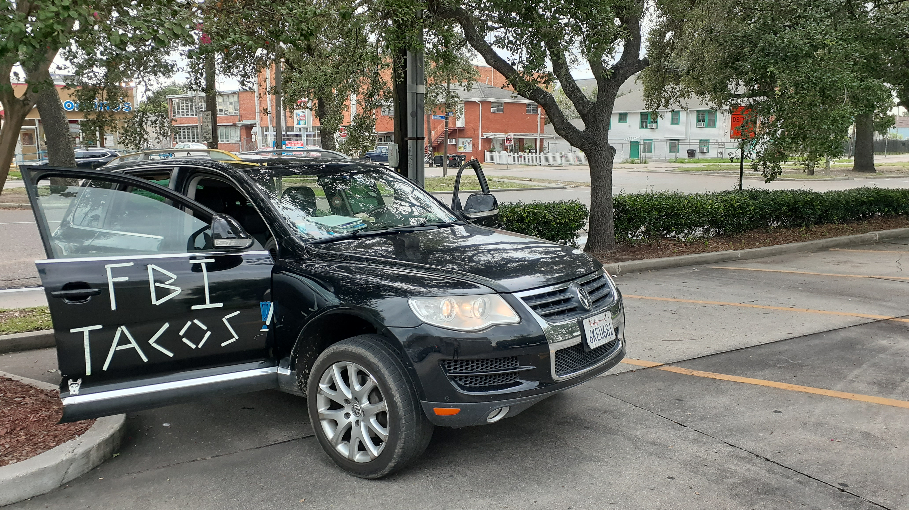
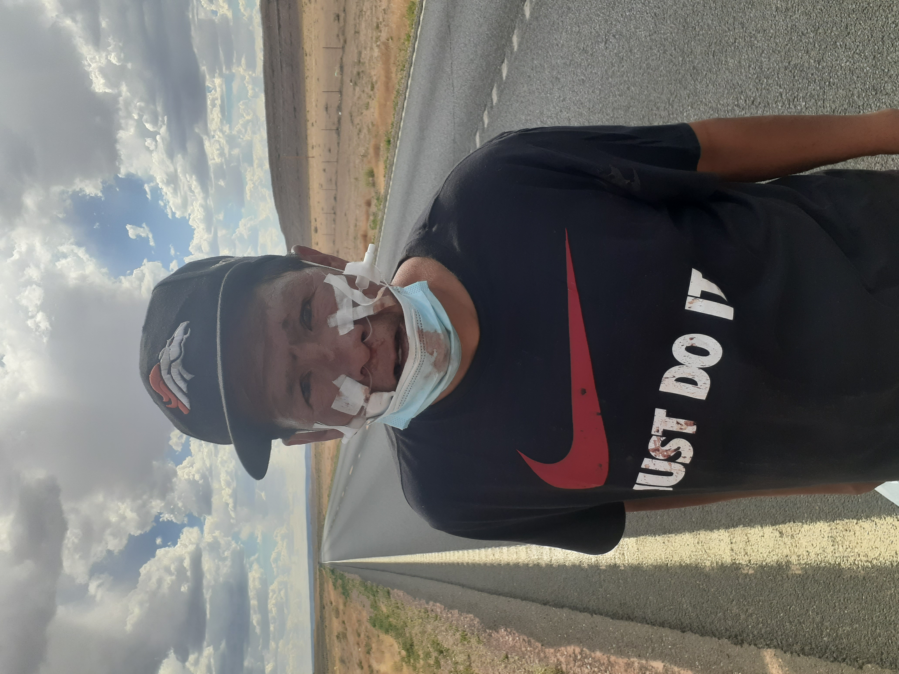
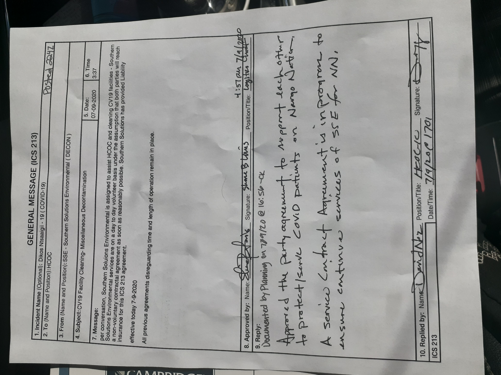

# D'Art Write-in, 2020, Vision for the Future.
# Nicholas D'Artagnan Dumas

This has been started, a few, times.

I was born from ["Old Dry Diggins,"](http://historichwy49.com/placer/pvhist.html) ["Hangtown"](https://hangmanstree.com/history/), now [Placerville](https://en.wikipedia.org/wiki/Placerville%2C_California)  known to be in [El Dorado County California](https://en.wikipedia.org/wiki/El_Dorado_County%2C_California) and the [State of Jefferson region](https://en.wikipedia.org/wiki/Jefferson_%28proposed_Pacific_state%29) . Nominated, on a handshake, for the role of **_President & Commander in Chief_**, in [Lotus](https://en.wikipedia.org/wiki/Lotus%2C_California); across the bridge from [Coloma, CA](https://en.wikipedia.org/wiki/Coloma%2C_California); [_the Mother Lode_](https://www.britannica.com/place/Mother-Lode-Country), where gold was discovered.

This event occurred after a discussion one evening; where, I was asked to hold my word. Being told people need to hear me; while, in childhood, I had the "*Quietest Gator*" Award from the C.R.C. Swim Team; and, I still feel gypped out of that 5th grade spelling bee.

I've been suggested to write as well; however, I didn't shake on it.

It seems as though all the right opportunities have formed themselves around creating my circumstantial journey.

I believe in [The Competent Individual](https://en.wikipedia.org/wiki/Competent_man)

# Actions Initialized
##### *some of these things are started on a, currently, locked device.*

## What have I been up to?

### [2018](pages/2018)

#### *See Nicholas D'Artagnan Dumas as President*

- ["Clear Your Vision"](pages/2018/cyv.md)
  - Windshield & Window Cleaning
    - D'Art Write-In, 2020; Vision for the Future.

- [Trashercize](pages/2018/tc.md)

- [Water Delivery](pages/2018/wd.md)

- [Tow Truck Operator](pages/2018/tto.md)

- [ML-Garbage_Bot](pages/2018/mlgb.md)
  - Image curation & location tokenization.

- [Collect Fusion Energy Now!](pages/2018/cfen.md)
  - M.I.T. Skunkworks & Lockheed Martin said by 2020... See my plans.

- [#be_home_LESS](pages/2018/bhl.md)

## [2019](pages/2019)

Tow Truck Operator transition to familial tasks + paperwork started. *imgs on locked device* [cellbrite fundRequest]().

Deployed web presence & structured more concepts:
- [Electric RickShaw](pages/2019/ers.md)
- Wepwawet (privacy in public)
- FireSide Chats
  - Getting my Electoral College "Pledges" with a ***Hack the Electoral College*** Campaign
  - find me on things like "Couchsurfing"
- [Sleucebox Politics](pages/2019/sbp.md)
   - Curated & Conceptualized Implementation
- [Feel the Thunberg!](pages/2019/ftt.md) 
  - Greta PSA reen***act***ment challenges.

## [2020](pages/2020)
- [Personal Opposition Spending Project](pages/2020/posp.md), measuring advertising effect. On Scott Santens Discord as @everybody#4559
- [Mask :arrow_up:](pages/2020/mu.md)
- Shasta - Redding to Arcata
- Concept w/ Bruce: [Distributed Food Delivery](pages/2020/dfd.md)
- Noted [homeless dispersed]() (#todo fixlink)
  - County & State Solutions 

- [F.B.I. Tacos](pages/2020/fbit.md)
  - 
- [Care a Van](pages/2020/cav.md)

- [Volunteer Navajo Nation Decontamination](pages/2020/vnnd.md)

- [Trashercise in Albuquerque](pages/2018/tc.md#Albuquerque)

- [FEMA Food Provider Contract Termination](pages/2020/ffpct.md)

- [Interview about my Video](https://www.wwltv.com/article/news/crime/new-video-aftermath-of-nopd-shooting/289-1e2fdc3d-0f0a-4b66-a32f-e0e02dc6de77) These guys used the wrong name and failed to implement the watermark denoting the source; as well as failed to compensate for exclusivity; I don't even want to use their link.

# 'Suits
## [Residency Issue Discoveries](pages/theSuits/Complaints/Residence)

 - [x] Action Initialized
 - [ ] Awaiting Action

### 2018

- [ ] "Obama Phones"
- [x] Private Postal Service
- [x] FinCEN
- [x] FEC (Federal Elections Commision)

### 2019

- [x] DMV
- [ ] EDD - unemployment
- [ ] HHS - DMV verification form issues
- ...etc...Fill in 

### 2020

- [ ] Blood Bank
- [ ] mediCal - meds staph
- [ ] Prisons
- [x] IRS - Stimulus
- [x] [Filed in LAED](pages/theSuits/Complaints/Residence/_assets/LAED-tributes_n_contacts)
- - [ ] Settle Signature & Address Deficiencies ... (Residence Address is the BASIS of the case.) {+img's}
- [ ] SCOTUS Challenge Electoral College arguments

## Other Complaints
### Seattle
#### Seattle PD
### Dallas
#### Med Center + Dallas PD
# NOLA
## NOPD
 - [VIDEO: Seatbelt Cut Out](https://bittube.tv/post/6c199aae-5103-4d0e-881e-20c95080812d)
 - [VIDEO: Officer Interaction](https://bittube.tv/post/347572af-c526-423c-8c69-f1ffd7aaf11a)
 - [AUDIO: "One Vehicle" Tow RAID, Parking Manager](https://bittube.tv/post/0fd2849b-4e65-4333-b923-1de4f8321333)
 - ### New Orleans
 - - #### NOPD, French Market, & DPW (etc...)
 - Presidential "Campaign Materials Hostage"

# Experience
- [C.E.D.A.](http://www.cedadebate.org/) (Cross Examination Debate Association)
  - [videoExampleHere](https://www.youtube.com/watch?v=JhzwSlK4uEc)
  - [__Nuclear Foreign Policy__](http://cedadebate.org/node/893), [*Team 4th(?) in Nation*](https://saccityexpress.com/debating-greatness/)
- Los Rios Colleges
  - A.A.'s
    - A.A. Social Sciences
    - A.A. Humanities
    - (informed of qualifications for Comms & some Maths)
- U.C. Merced declarations
  - B.Sc. Major Cognitive Science
  - Minors
    - [Cultural] Anthropology
    - Philosophy
- [envisioning.io](https://www.envisioning.io/clients/deftech)
  - [RNLAF](https://en.wikipedia.org/wiki/RNLAF) & [DefTech](http://deftech.ch/)
- [PinzaGroup](https://pinzagroup.com/wp-content/endurance-page-cache/_index.html)
  - Commercial Real Estate Startup in 2014
- [DroneBuilder.io](https://angel.co/company/dronebuilder)
  - Calculate Before You Build
- [Opainc.net](http://opainc.net/)
  - The Integrated Risk Management Group

# [Find Me & Ask Me's]'(#fmam-pulls?)

What are you wondering about?

Enforcement / Policing, Judges, Attorneys, & D.A.'s, Prosecutorial Fairness, Institutionalized Bias, etc...

Note:: "Frictionalized system... discovery & access eg: Bus Tickets 'home'
