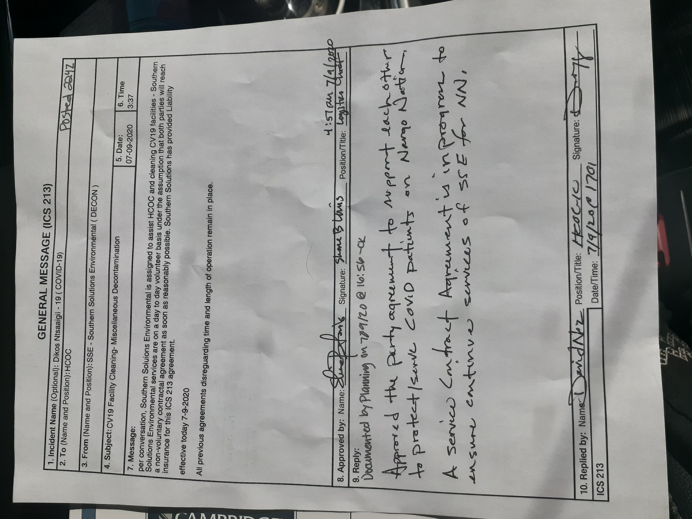

# Volunteer Navajo Navajo Decontamination 

Instrumental in initital negotiations for the $10mil C.A.R.E.S. Act Contract.

[Burke Andersson has the record](http://burkefornevada.com/)

<!---->

<!---->

<!---->

