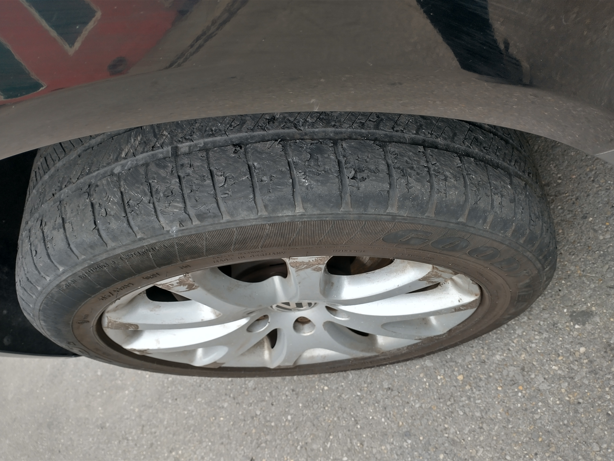
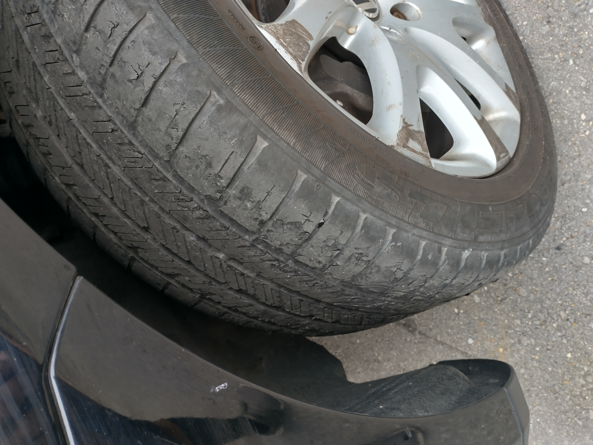

# things that would be helpful

## raise awareness on what it means to establish a "more perfect union"

## Fiscal Agent

- allowing OpenCollective.com/Dartanium (and others) to be operational.

## Coffee for my O.S.

Coffee for my Office Space

<!--HASH encrypted original -->

## Travel

- To D.C. before December ... 
  - SCOTUS doesn't accept e-files from Pro Se litigants; so, let's hand deliver.

## Vehicle Maintenance

- [ ] wheel lock key ordered from VW
  - [ ] install Spare
- [ ] Tire(s)
<!--    -->
  - [ ] Full Time 4WD is tearing the, unequally sized, tires apart. {#todo+todo flatTire NoFix Pic}
[See: pANDorA](htttps://OpenCollective.com/Dartanium)

## Debaters to initiate

## Information Requests

Public Records
<!--nesting checkboxes issues #todo+todo -->
  

 CA 
 
    - [ ] El Dorado County 
    - [ ] Sacramento County 
    - [ ] Contra Costa County 
    - [ ] San Francisco 
    - [ ] Merced County 

  - [ ] 

Washington

    

- [ ] Seattle
<!--goingto lose markdown checklists( & indents?)-->
      

  - [ ] encounter#1
<!--yeah, no inline html; i kno...-->
        - [ ] audios 
        - [ ] videos 
        - [ ] reports 
        - [ ] call logs 
        - [ ] gps logs 
        - [ ] dispatch logs
      

      

- [ ] encounter#2 - illegal search

        - [ ] audios 
        - [ ] videos 
        - [ ] reports 
        - [ ] call logs 
        - [ ] gps logs 
        - [ ] dispatch logs 
      

    

  - [ ] 

Texas

    - [ ] Dallas 
      - [ ] encounter#1 - Med City Event 
        - [ ] audios 
        - [ ] videos 
        - [ ] reports 
        - [ ] call logs 
        - [ ] gps logs 
        - [ ] dispatch logs 

  - [ ] 

Louisiana

    - [ ] 

New Orleans

      - [ ] 

encounter#1

        - [ ] 

audios

          - [ ] NOPD 
          - [ ] State Trooper 
         

        - [ ] videos 
          - [ ] French Market 
          - [ ] B.B. Kings 
          - [ ] NOPD 
        - [ ] reports 
          - [ ] NOPD 
          - [ ] DPW - Parking 
        - [ ] call logs 
          - [ ] NOPD 
          - [ ] State Trooper 
          - [ ] AutoPound 
        - [ ] gps logs 
          - [ ] DPW - Parking 
          - [ ] NOPD 
          - [ ] State Trooper 
          - [ ] AutoPound 
        - [ ] dispatch logs 
          - [ ] DPW - Parking 
          - [ ] NOPD 
          - [ ] State Trooper 
          - [ ] AutoPound 
      

    

<!-- Segwit Compat BTC, P2SH="3BCsp8UVfPdUZCntw9wjgTGsm5N7BQvENp"-->
