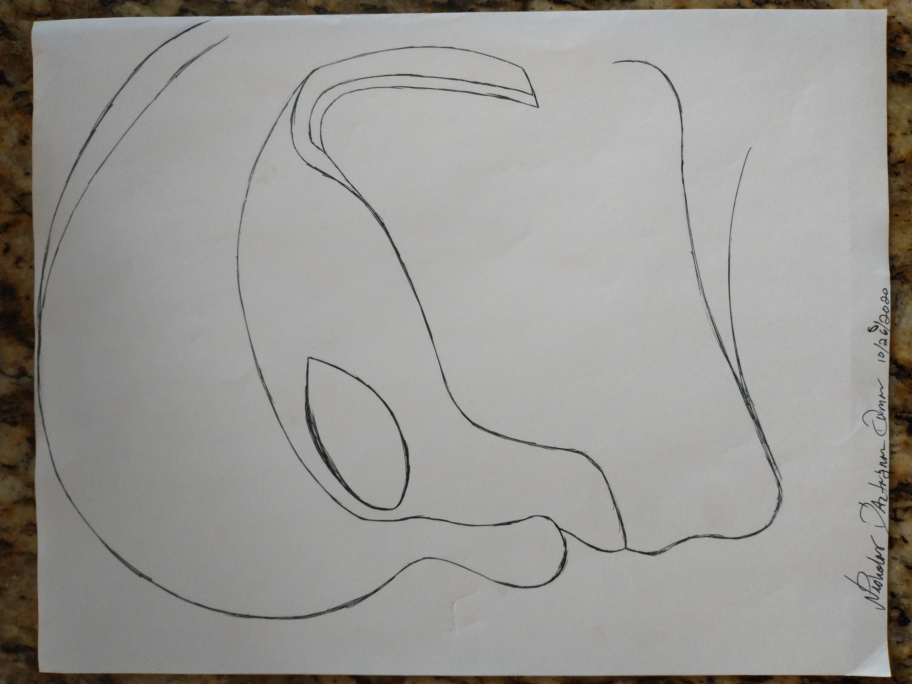
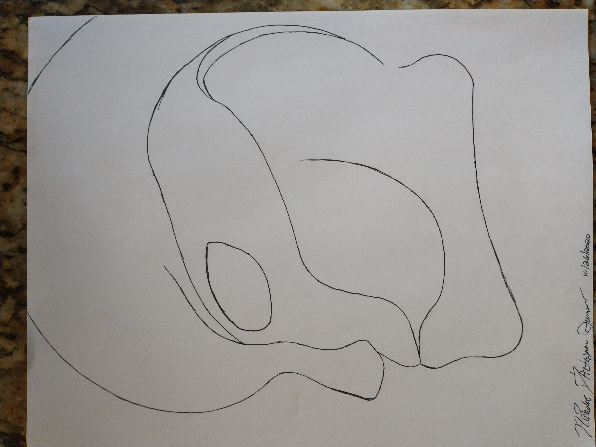
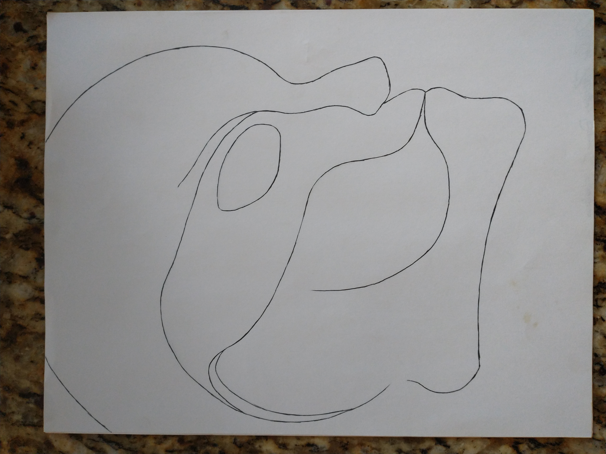

 

₁Original

₁ₒ.Mirror¹

 

 
 ₁ₒ.Fork¹
 

₁ₒ..𝒻₁.Mirror¹

---

 

 
 
 
 

---

 

₁ₒ.ₘ₁.բ₁.ₘ₁.Copy¹

~~¹ᵒ.ᵐ¹.ᶠ¹.ᶜ¹.Fork¹~~

~~₁ₒ.ₘ₁.𝒻₁.𝒸₁.Fork¹~~

  ꜀
⁰ ¹ ² ³ ⁴ ⁵ ⁶ ⁷ ⁸ ⁹

₀ ₁ ₂ ₃ ₄ ₅ ₆ ₇ ₈ ₉
꜀
ₒ.ₘ
բ₁. 

ᵐ ᶠ ᵒ ᶜ

ᵐ ᶠ ᵒ ᶜ

 
ₒ.բ₁.

[AlphaProtoDemo](https://docs.google.com/spreadsheets/d/1fV5d5xh4jVgf64LqQeruthXGeCErheku01y3v7Fnac4/edit?usp=drivesdk)

the quick brown fox jumped over the lazy dog. THE QUICK BROWN FOX JUMPED OVER THE LAZY DOG
