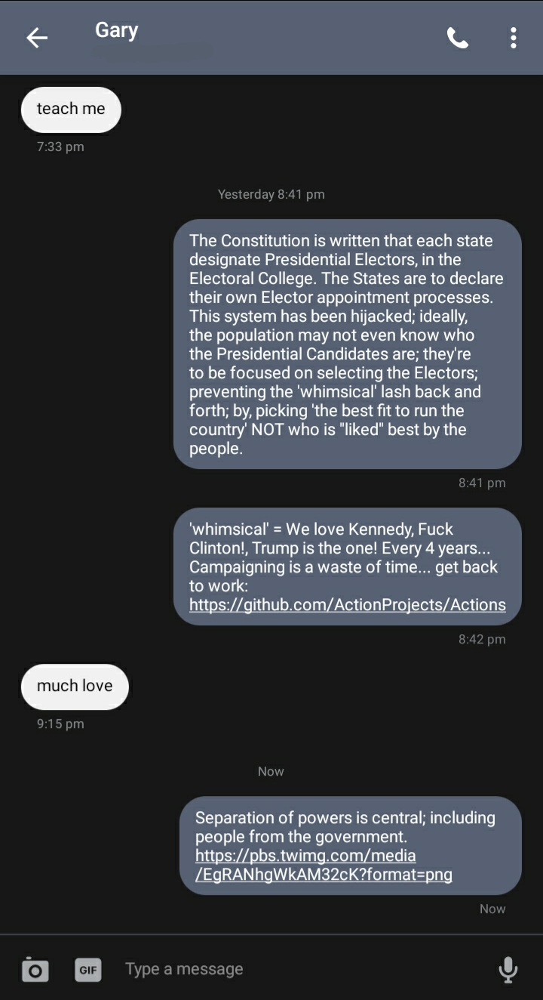

# Hijacked System

___

[insQuote](__ "unexpected")

## More Perfect Union

> what they want

> what they think they need

> what they think they want

> what they actually need

"I want to pick"
"I want my voice to be heard"
"I didn't vote..." "...b'cause..."
  - I didn't like either

"I voted for..." "...b'cause..."
  - "I didn't want the 'other' to win"
  - "I really want(ed) 'x' to be..."

> So, 
> you want x; 
> you vote for y; 
> because; you didn't like z.

## Swaying Ships

  <!--- -->

## Money Games

A war of finance.

### Biden

- $1.2Billion spent <!-- get FEC data-->
  - % in polls

## Emotion>Logic

[Asch Conformity Studies](__ "confor-mist")

