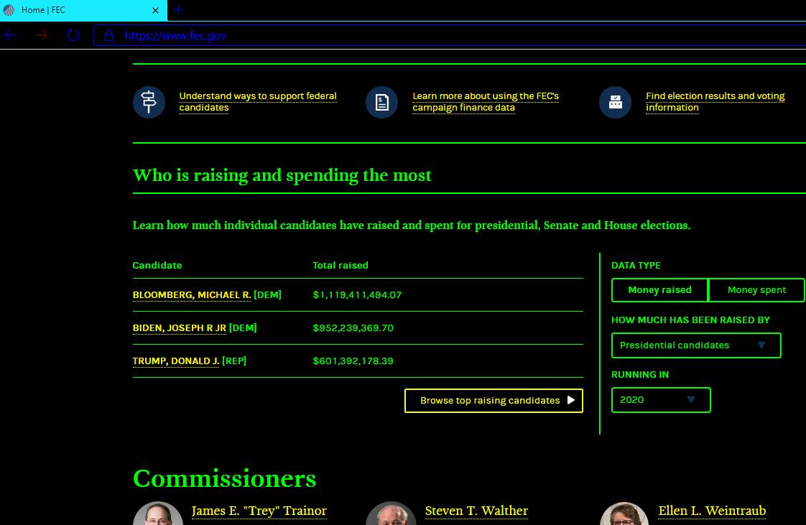

# SCOTUS Electoral College Decision

The decision invalidates the central role of the Electoral College. 
The Electors chuse [sic] the President; and, the systems faith is in knowing this whole's discretionary character; predicated upon their nomination and election to position.

The state legislature to mandate a Popular Vote to take all minifies the core to merely a 'point system;' whereby no Electors are needed.

<!-- Time to make a timely decision when NV Stokkes issues present themselves, among other issues.-->

## The meeting of the Electors to sign on their, final, decisions.

Thus this system's  entire reliance is upon representation; at its foundation is the formation of a select set of individuals; with, which whom the power lay to establish the grounds of each governance cycle, through further selections of judicial officials. The very nature of the system is through indirect  powers; giving authorative responsibility to those entrusted. This design had [in part] the intention of slowing the public sway to some momentary swing of position; generating a stable system.

<!-- Party picking of Electors +todo #todo cite -->

# PLEDGE LAWS

The idea of appointing them in the first place establishes contrary grounds than is argued in the [19 465_i425](https://www.supremecourt.gov/opinions/19pdf/19-465_i425.pdf) opening statements. Rather than simply assigning a "points system" to the states; there *is* the layer of Elector discretionary power to cast their vote.

This systems fundamental design is around the separation of powers; including the people from the government, through the filters of representatives.

To bind a contract to a vote is abhorrent. <!--the people want it! ... 'explicitly prohibited' people are free to make the change for direct control-->

Thus this exemplifies the public interest in maintaining a just system through the chusing of the representing individuals. Laying the burden of knowing the characters of those who set the tone of the nation.

Citing Justice Jackson
> "no one faithful to our history can deny that the plan originally contemplated what is implicit in its text – that electors would be free agents, to exercise an independent and nonpartisan judgment as to the men best qualified for the Nation's highest offices."

<!--
The history of recent debates around this seem to adjust words weightings; changing the context of them to a slanted perspective; with continued eschewing of the premise in the original document.

Firstly with the decisions set forth and further by the adherence to without requestioning of the faulty decision <!-- what's this called again?--><!-- Justice Jackson spoke out on. {thought I fixed this one in pre-v.2-->

> The next clause (but don’t get attached: it will soon be su-
perseded) set out the procedures the electors were to follow 
in casting their votes. In brief, each member of the College 
would cast votes for two candidates in the presidential field. 
The candidate with the greatest number of votes, assuming
he had a majority, would become President. The runner-up 
would become Vice President. If no one had a majority, the 
House of Representatives would take over and decide the 
winner.

> That plan failed to anticipate the rise of political parties,
and soon proved unworkable. The Nation’s first contested 
presidential election occurred in 1796, after George Wash-
ington’s retirement. John Adams came in first among the
candidates, and Thomas Jefferson second. That meant the 
leaders of the era’s two warring political parties—the Fed-
eralists and the Republicans—became President and Vice
President respectively. (One might think of this as fodder
for a new season of Veep.) Four years later, a different prob-
lem arose. Jefferson and Aaron Burr ran that year as a Re-
publican Party ticket, with the former meant to be Presi-
dent and the latter meant to be Vice. For that plan to
succeed, Jefferson had to come in first and Burr just behind
him. Instead, Jefferson came in first and Burr . . . did too. 
Every elector who voted for Jefferson also voted for Burr, 
producing a tie. That threw the election into the House of 
Representatives, which took no fewer than 36 ballots to
elect Jefferson. (Alexander Hamilton secured his place on
the Broadway stage—but possibly in the cemetery too—by
lobbying Federalists in the House to tip the election to Jef-
ferson, whom he loathed but viewed as less of an existential 
threat to the Republic.) By then, everyone had had enough
of the Electoral College’s original voting rules.

~ [19-465_i425](https://www.supremecourt.gov/opinions/19pdf/19-465_i425.pdf)

<!--Who is "everyone"?-->

<!-- Constitutional Power of establishing a political party --><!--Freedom tho!-->

<!--(One might think of this as fodder
for a new season of Veep.)--> <!--really? Does the VP Control anything? Even w/out a vote? Do both sides get something? What would we learn about the selected's abilities to work on the nation?-->

What is the problem with opposing political parties representing Presidential and Vice- offices? How is this "unworkable"? Is it not stated in the constitution that it is decided by the House'o'Rep's?

Contrary to the existing status quo; the premise that the Electoral College candidate selection may be, prima faci, the most in important selection process. Where, the decisions regarding the 12th Addendum and selecting Candidates for the Electoral College predicated upon the popular presidential candidate 

## Is the Party System the Problem?

aren't parties inherently, also bound to, special interests?

## It should be said

Let's fill this paper with fluffy words to immaculate how we enunciate the points to be had; poigniantly painting the paradigm in a shade with word choice and selection; changing the way you make the interpretation; through a lensing senstation.

There are things which are blatantly more easily observed in the forest than from out of it and visa~versa.

> A word is worth a thousand pictures too; you know, Grandpa.

~ Kimberly Alivia Dumas

This paradigmical lensing of a society to follow a tradition; rather than the mechanical implementation, beginning with a feud (cite July6th), seems to be an unspoken blindspot (the unexpected evolution of the party system) in a type of 'Survivor/Success(airplanes&buildings) Bias' issue. Where do we draw the line when it comes to 'Group Think' and [conformity](https://en.wikipedia.org/wiki/Asch_conformity_experiments). While appearances are had that the best arguments are made by those at the top of some [social hierarchy](https://courses.lumenlearning.com/boundless-sociology/chapter/the-class-structure-in-the-u-s/), with premises of 'merits'<!--; established by time-->. Where is the argument for doing it right?

### Should we even know who might be considered for President?

> ~best for the nation

not liked most by the people

## Candidate Selection

### Election by a 'special quorum' 

<!-- explicite consistitutional stateents +cite July6th; cite constitution -->
> The Electors shall meet in their respective States

What is the purpose of the meeting if they are to be bound by a prior contract?
Should we be binding Electors, at a State level; or should these "proxies" be enforced privately?

### The Electoral College is the most important pick.

<!-- best for the country doesn't mean liked by the people -->
<!-- cite emotional response studies, dials on videos during Obama speeches; etc... -->

Should a candidate even know they are being considered to fulfill a national duty?

What does it mean to be 'Nominated'?

### Should the Presidential Candidate even know they are being considered?

> Candidates should have a reason to campaign in all 50 states
*~ https://www.nationalpopularvote.com/state-status*

Should candidates be "Campaigning" at all?

Would the public be rioting? Isn't this the opposite of the direction envisioned by 'the Founders'

## Working in a hijacked system.

<!--### on the financial system--><!--words!ComeBack! {HASH}-->

### on freedom

we are free to be deceived.

<!--if ignorance makes us happier.-->
<!--
#### Think of a {--} gang (partyRings)

#### bRacketeering systems

## Financial Advancements - Disenfranchise

FEC Homepage

### Bloomburg spends $600mil {wait, updating}

### Transients are able to contribute

## Equal voices and freedom of speech by the dollar.
-->
<!-- to read use THIS HASH sent/txt'd to some people -->

To know our system better

[these are the quadrennial considerations](https://en.wikipedia.org/wiki/List_of_2016_United_States_presidential_electors)

If you believe in the constitution; then, maybe we should give the *Real Electoral College* a try.
